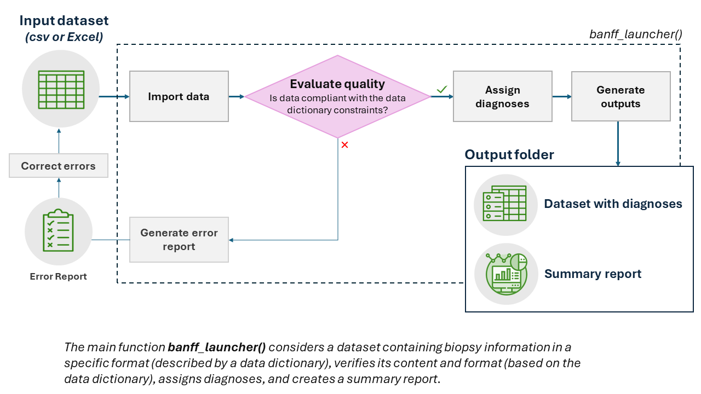

<!-- README.md is generated from README.Rmd. Please edit that file -->

# banffIT

<!-- badges: start -->

[](https://github.com/PersonalizedTransplantCare/banffIT/actions/workflows/R-CMD-check.yaml)
<!-- badges: end -->

The banffIT package provides functions to assign standardized diagnoses
using the Banff Classification (Category 1 to 6 diagnoses, including
Acute and Chronic active T-cell mediated rejection as well as Active,
Chronic active, and Chronic antibody mediated rejection). The main
function `banff_launcher()`considers a minimal dataset containing
biopsies information in a specific format (described by a data
dictionary), verifies its content and format (based on the data
dictionary), assigns diagnoses, and creates a summary report. It is
possible to use different versions of the Banff classification.

## Main functionality



<br>

# DISCLAIMER

The banffIT package is distributed in the hope that it will be useful,
but without any warranty. By using the banffIT package, you agree that
its contents are used only for research purposes and not for making
clinical decisions regarding patient care without consulting a
pathologist. It is provided “as is” without warranty of any kind, either
expressed or implied, including, but not limited to, the implied
warranties of merchantability and fitness for a particular purpose.

In no event unless required by applicable law the author(s) will be
liable to you for damages, including any general, special, incidental or
consequential damages arising out of the use or inability to use the
program (including but not limited to loss of data or data being
rendered inaccurate or losses sustained by you or third parties or a
failure of the program to operate with any other programs), even if the
author(s) has been advised of the possibility of such damages.

# Download section

<button>

<a href="https://PersonalizedTransplantCare.github.io/banffIT-documentation/templates/banff_dictionary.xlsx" download class="external-link">Data
Dictionary</a>
</button>

also available in R using `get_banff_dictionary()` </br>

<button>

<a href="https://PersonalizedTransplantCare.github.io/banffIT-documentation/templates/banff_template.xlsx" download class="external-link">Template</a>
</button>

also available in R using `get_banff_template()` </br>

<button>

<a href="https://PersonalizedTransplantCare.github.io/banffIT-documentation/templates/banff_example.xlsx" download class="external-link">Example</a>
</button>

also available in R using `get_banff_example()` </br>

# Get started

## Install the package and use the example file

``` r

# To install banffIT
install.packages('banffIT')

library(banffIT)
# If you need help with the package, please use:
banffIT_website()

# use example
version <- 2022
input_file <- system.file("extdata", paste0(version,"/banff_example.xlsx"), 
                          package = "banffIT")
banff_launcher(
  input_file = input_file,
  output_folder = tempdir(), # 'folder_path/example'
  version = version,
  language = 'label:en',
  option_filter = adequacy == 1,
  detail = TRUE)
```
